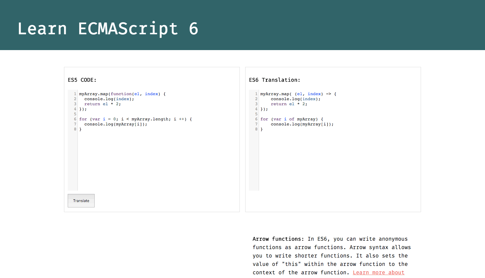

# Learn ECMAScript 6

ECMAScript 6, or ES6, is the first and most significant update to JavaScript since ES5 was standardized in 2009. We were very excited by the new features and wanted to make learning it as easy as possible.

There are a lot of informative documents written for learning ES6, but we wanted a more interactive tool. We asked ourselves, how might our ES5 code look different in ES6? And from there our web app was born.

## Getting started

To set up **Learn ECMAScript 6**, run these commands:
```
git clone https://github.com/TeamSmores/learn-ecmascript6.git
cd learn-ecmascript6
npm install
npm start
```
Then open ```localhost:3000``` in your browser.

## Usage
Input your ES5 JavaScript in the **ES5 Code** editor, click **Translate** and see what your code looks like in ES6 with some help tips at the bottom. That's it!



Note: **Learn ECMAScript 6** currently supports arrow functions and "for... of" statements. We hope to add more ES6 features in the future.
